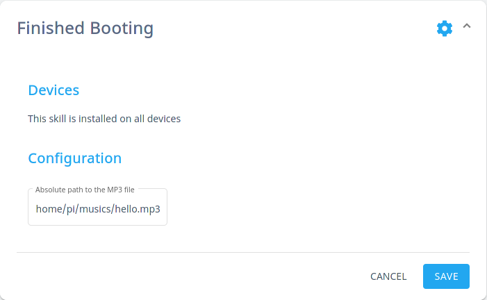

     

#  Finished Booting

Play a sound or speak when Mycroft AI has finished booting up

## About 

With this skill Mycroft will say "finished booting" or play a sound when the boot up period has finished and is ready to receive commands.

## Examples 
There is no example because there is no interaction with the Mycroft.

## Credits 
zelmon64 (@zelmon64)
Wally Fort (@fortwally)
JarbasAI (@JarbasAI)
Luke (@luke5sky)
benklop (@benklop)
goldyfruit (@goldyfruit)

## Category
Configuration

## Configuration

This skill utilizes the `settings.json` file which allows you to configure this skill via home.mycroft.ai after a few seconds of having the skill installed you should see something like below in the https://home.mycroft.ai/#/skill location.

You may optionally add a configuration to play an mp3 file instead of speaking:

## Tags

#basic
